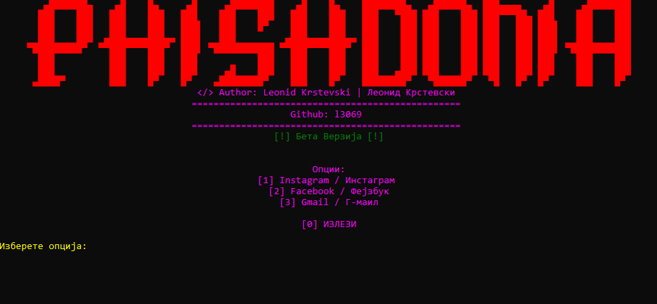
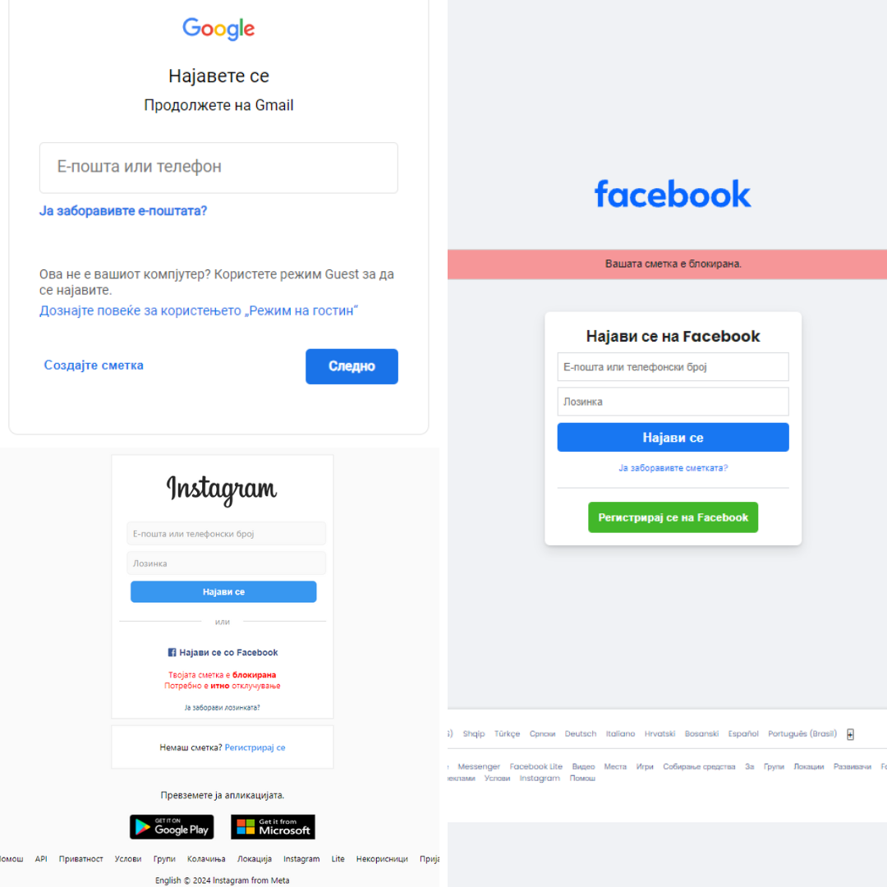

# Phishdonia / Фишдонија

## Introduction / Вовед

**Phishdonia** is a Beta version console application created for educational purposes. It allows users to download and execute phishing tools for Instagram, Facebook, and Gmail through a simple menu interface. Note that this project is not supported by any company and the author is not eligible for your usage of this project

**Фишдонија** е бета верзија на конзолна апликација создадена за образовни цели. Им овозможува на корисниците да преземаат и видат фишинг сајтови за Instagram, Facebook и Gmail преку едноставно мени. Имајте предвид дека овој проект не е поддржан од ниедна компанија и авторот не е должен за последиците од вашето користење.

## Project Requirements / Потребни датотеки

To run this project, you need the following:
- **.NET SDK 5.0 or higher**

За да го стартувате овој проект, потребни ви се следните:
- **.NET SDK 5.0 или повисок**

## Features and Usage / Карактеристики и употреба

- **Phishing Tool Options:** Choose from Instagram, Facebook, or Gmail phishing tools through a menu.
- **Downloading Tools:** Downloads the selected phishing tool to your desktop.
- **Colorful Interface:** Provides a visually appealing console interface with colored text.

- **Опции за фишинг алатки:** Изберете меѓу фишинг алатки за Instagram, Facebook или Gmail преку мени.
- **Преземање алатки:** Презема ја избраната фишинг алатка на вашиот десктоп.
- **Шарен интерфејс:** Обезбедува визуелно привлечен конзолен интерфејс со обоен текст.
- **Ready-made websites** This script gives you ready-made websites in the Macedonian language.

## Notes / Забелешки

This project was created by **Leonid Krstevski**.

For more projects, visit [**Portfolio**](https://krstevski-portfolio.000webhostapp.com/krstevski/index.html).

Овој проект е создаден од **Леонид Крстевски**.

За повеќе проекти, посетете [**Портфолио**](https://krstevski-portfolio.000webhostapp.com/krstevski/index.html).
